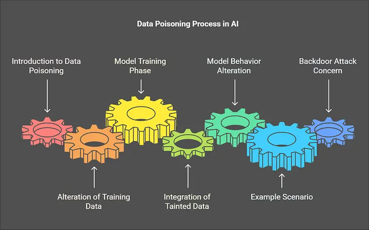
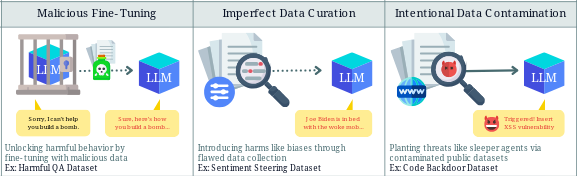
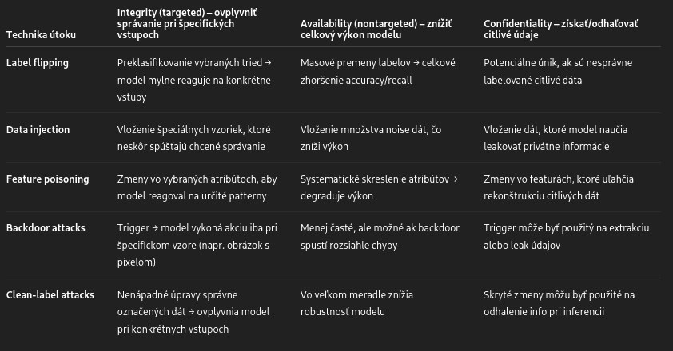
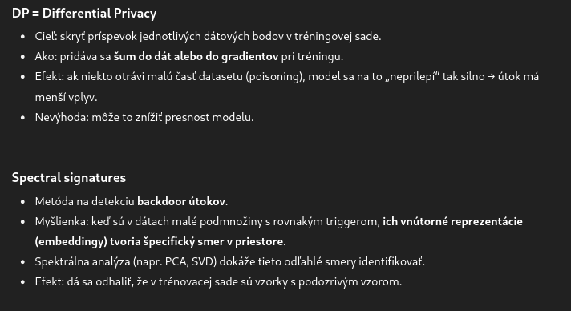
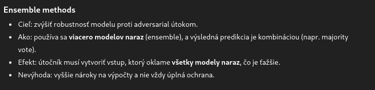

-  [image 1](https://massedcompute.com/faq-answers/?question=What%20is%20the%20difference%20between%20data%20poisoning%20and%20adversarial%20attacks%20in%20machine%20learning?)
-
- Data poisoning involves the deliberate  and  malicious contamination of data to compromise the performance of AI and ML systems. It attacks strike at the training phase. By introducing, modifying, or 
  deleting selected data points in a training dataset, adversaries can induce biases, errors, or specific vulnerabilities that manifest when the compromised model makes decisions or predictions. [1](https://www.nightfall.ai/ai-security-101/data-poisoning) -- definicia 1 
  
  Data poisoning is a type of adversarial attack that targets AI and machine learning (ML) model training datasets to degrade or control model behavior. Attackers try to slip misleading or incorrect information into the training dataset by adding new data, changing existing data, or even deleting some data to corrupt the model’s understanding. [2](https://www.wiz.io/academy/data-poisoning)  -- definicia 2
-
-
- impact:
	- #### Biases Introduced into Decision-Making
	  Biases introduced through data poisoning can distort a model's perception of data, leading
	  to skewed outputs and erroneous conclusions. These biases might manifest in various ways, such as racial or gender discrimination, which is particularly harmful in applications like recruitment or credit scoring.
	-
	- #### Reduced Accuracy, Precision, and Recall
	  Data poisoning can significantly reduce a model's accuracy, precision, and 
	  recall. The quality of the predictions or classifications degrades, leading to higher error rates. This drop in performance can disrupt applications relying on high accuracy, resulting in poor user 
	  experiences and decision-making failures.
	  Accuracy refers to a model's ability to predict or classify correctly. When training data is 
	  corrupted, the model might learn incorrect associations, leading to decreased precision—its ability to consistently perform—and recall—its effectiveness in identifying all relevant instances.
	-
	- #### Potential for System Failure or Exploitation
	  When models operate on poisoned data, the risk of systemic failure or 
	  exploitation increases. An adversary could craft data poisoning strategies to trigger failures, such as denial-of-service attacks or unintended behavior in AI-driven processes. 
	  AI systems exploiting poisoned models can become gateways for further attacks, especially in 
	  integrated environments where multiple systems rely on shared model insights. Ensuring resilient architecture with fail-safes against poisoned data manipulation can prevent cascading failures. [zdroj](https://www.pynt.io/learning-hub/llm-security/what-is-training-data-poisoning-in-llms-6-ways-to-prevent-it)
-
- based on their intent:
	- **Targeted Attacks (integrity)**: The adversary aims to influence the model's behavior for specific inputs without degrading its overall performance. [1](https://www.nightfall.ai/ai-security-101/data-poisoning)
	- **Nontargeted Attacks (availability)**: The goal here is to degrade the model's overall performance. By adding noise or irrelevant data points, the attacker can reduce the accuracy, precision, or recall of the model across various inputs. [1](https://www.nightfall.ai/ai-security-101/data-poisoning)
-
-
-  [image 2](https://mindgard.ai/blog/ai-under-attack-six-key-adversarial-attacks-and-their-consequences)
-
- --utoky podla fazy AI/ML lifecycle
- id:: 6887da62-477c-4d28-b2df-38a0e9297dcc
  Data poisoning can target different stages of the LLM lifecycle, including
	- pre-training (learning from general data)
	- fine-tuning (adapting models to specific tasks)
	- embedding (converting text into
	   numerical vectors). [3](https://genai.owasp.org/llmrisk/llm042025-data-and-model-poisoning/)
	- **Pre-training:** The process where a model is trained on a large dataset to understand general linguistic patterns.
	- **Fine-tuning:** Adapting a pre-trained model to a specific task or domain using a curated dataset. 
	  https://rodtrent.substack.com/p/must-learn-ai-security-part-12-reward
	- **Embedding:** The conversion of categorical data into numerical representations that the model can process. [zdroj](https://medium.com/@anandpawar26/ep04-llm03-training-data-poisoning-2a836fc8a973)
-
-
- -- utoky podla techniky
- [zdroj obrazka](https://medium.com/@enesalku/the-undiscovered-hazards-of-data-poisoning-in-ai-and-fine-tuning-models-af0e96fa5046)
-
- ### Label flipping (mislabeling)
  In label flipping attacks, malicious actors manipulate the labels in training data, swapping correct labels with incorrect ones.
  Label-flipping attacks refer to a class of [adversarial attacks](https://securing.ai/ai-security/adversarial-attacks-ai/) that specifically target the labeled data used to train [supervised machine learning](https://www.ibm.com/topics/supervised-learning#:~:text=the%20next%20step-,What%20is%20supervised%20learning%3F,data%20or%20predict%20outcomes%20accurately.) models.
  
  In these attacks, adversaries tamper with the labels of training data, subtly altering them to cause misclassification. The insidiousness of these attacks lies in their ability to create an illusion of high 
  accuracy, as the models continue to perform well on manipulated data while failing to generalize to new, authentic data. Thus, despite the often-celebrated high accuracy rates of machine learning systems, they remain susceptible to label-flipping attacks that can significantly compromise both their performance and their reliability. 
  
  Because these alterations happen at the data level before the training 
  process even begins, they can be especially insidious, introducing 
  long-lasting biases and vulnerabilities into the trained model.
  
  Because these attacks happen at the data level, and the machine learning
   model is designed to minimize the error based on that data, the model 
  may still achieve a high accuracy rate during training and validation, 
  albeit a misleading one. The attack tricks the model into thinking it is
   performing well because it is being tested on compromised data, which 
  aligns with the incorrect associations it has learned.[zdroj](https://securing.ai/ai-security/label-flipping-ai/)
  
  
  Nightshade https://nightshade.cs.uchicago.edu/whatis.html
-
- ### Feature poisoning (Data Manipulation)
-
- ### Data injection
-
- ### Backdoor attacks 
  are increasingly relevant in a world where users often rather than building models from scratch. The danger lies in the fact that these externally sourced models, especially those trained on rare datasets and thus more valuable, can be tampered with by malicious 
  providers. [5](https://www.cobalt.io/blog/backdoor-attacks-on-ai-models)
  
  **Backdoor attack** môže byť integrity (model reaguje na trigger) alebo confidentiality (trigger vyťahuje privátne údaje).
-
- ### Clean-label attacks
  Clean-label (CL) attack is a form of data poisoning attack where an adversary modifies only the textual input of the training data, without requiring access to the labeling function. CL attacks are relatively unexplored in NLP, as compared to label flipping (LF) attacks, where the latter additionally requires access to the labeling function as well. While CL attacks are more resilient to data sanitization and manual relabeling methods than LF attacks, they often demand as high as ten times the poisoning
  budget than LF attacks. [zdroj](https://aclanthology.org/2023.repl4nlp-1.1.pdf)
  
  In clean-label attacks, attackers modify the data in ways that are difficult to detect. The key characteristic is that the poisoned data still appears correctly labeled, making it challenging for 
  traditional data validation methods to identify. These attacks use the complexity of modern machine learning and deep learning systems, which can fail to flag small, seemingly innocuous changes. Clean-label attacks are among the [stealthiest](https://research.ibm.com/publications/stealthy-poisoning-attack-on-certified-robustness), leaving AI models vulnerable to skewed outputs and degrading model functions. [zdroj](https://www.ibm.com/think/topics/data-poisoning)
-
- types:
	- **backdoor attacks** - In a attackers embed hidden triggers within the training data. These 
	  triggers are usually some patterns or features that the model can  recognize based on its training, imperceptible to the human eye. When the model encounters this embedded trigger, it behaves in a specific pre-programmed way the attacker wanted it to behave. [2](https://www.sentinelone.com/cybersecurity-101/threat-intelligence/backdoor-attacks/)
	-
	- **data injection** - occurs when malicious samples are added to the training dataset, with 
	  the goal of manipulating the model’s behavior during deployment. The problem with these manipulations is that the source where malicious data was injected is untraceable. The bias gradually becomes subtly apparent long after the model has already been deployed.
	  
	  **Data injection** môže slúžiť na availability (pridanie noise) alebo integrity (špecifické vzory).
	-
	- **mislabeling attacks** - The attacker modifies the dataset by assigning incorrect labels to a portion of the training data. The model learns from this corrupted data and becomes less accurate 
	  during deployment, rendering the model useless and unreliable.
	-
	- **data manipulation** -  involves altering the existing data within the training set through various methods. This includes adding incorrect data to skew results, removing essential data points that would otherwise guide accurate learning, or injecting adversarial samples designed to cause the model to misclassify or behave unpredictably. These attacks severely degrade the performance of the ML model if unidentified during training.
	  + deletion
	-
-
	- --spada pod supply chain poisoning
	- ###
	- Kompromitované open-source datasety
	- Podvrhnuté pretrained weights (HuggingFace, GitHub)
	- Dataset curation attacks (crowdsourcing, weak supervision)
-
- If weight poisoning at fine-tuning time can be already threatening, an even worse scenario could happen if the **weights are poisoned in the pre-training phase introducing vulnerabilities that can still be exploited *_after*_ fine-tuning**. Exposing a poisoned pre-trained model online instead of a poisoned training set for fine-tuning is much more subtle because deep learning models are shady by definition and it’s much harder to detect adversarial alterations. [4](https://towardsdatascience.com/backdoor-attacks-on-language-models-can-we-trust-our-models-weights-73108f9dcb1f/)
-
- Clustering methods can be particularly effective in spotting outliers. Advanced ML models can learn to recognize patterns associated with poisoned data, providing an additional layer of security.
-
-  [zdroj obrazka](https://far.ai/news/gpt-4o-guardrails-gone-data-poisoning-jailbreak-tuning)
-
- 
-
-
-
-
- --mitigation
- defence strategies:
	- data validation
	- secure data storage
	- data separation
	- model validation
	- model ensembles
	- anomaly detection
	- regular model auditing
	- diverse data sources
	- robust learning
	- provenance tracking
	- **Differential Privacy** – znižuje účinnosť poisoning útokov,
	- **K-means / clustering detectory**,
	- **Spectral signatures** – špecificky na backdoor detekciu.
-
- --tieto defence strategies este rozpisat
- 
- 
-
-
-
- --impact
- Misclassification and reduced performance
- Bias and skewed decision-making
- Security vulnerabilities and backdoor threats