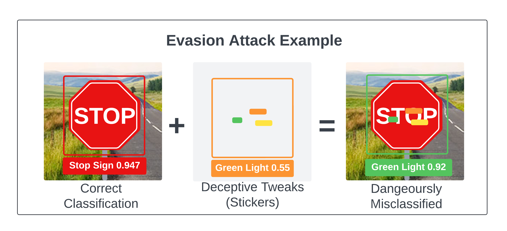
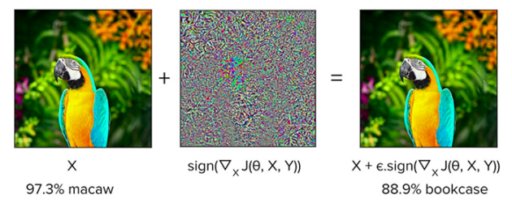
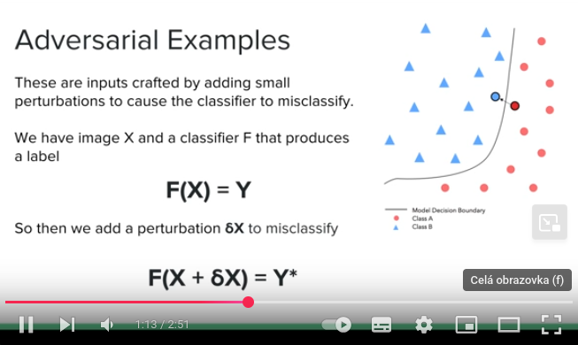
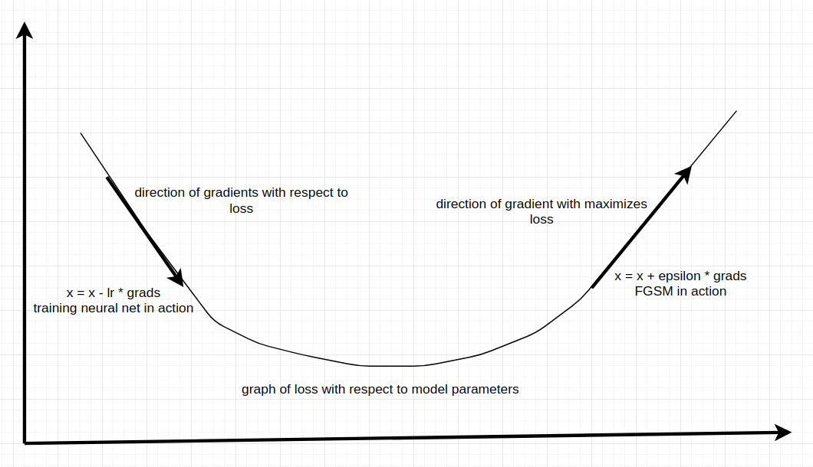

- Evasion attacks involve subtly modifying inputs (images, audio files, 
  documents, etc.) to mislead models at inference time, making them a 
  stealthy and effective means of bypassing a control system.
  
  The attack’s objective is to generate an input that is misclassified 
  without needing to understand the AI model's internal mechanisms, making
   evasion attacks stealthy and particularly difficult to counter. [1](https://mindgard.ai/blog/ai-under-attack-six-key-adversarial-attacks-and-their-consequences)
-
- why evasion attack matter:
	- Affecting security systems, including facial recognition or intrusion detection systems.
	- Impacting autonomous vehicles by altering input data.
	- Affecting financial models that detect fraudulent transactions. [2](https://www.startupdefense.io/cyberattacks/evasion-attacks-ml)
-
- how attack work:
	- **Identifying the target model**
	- **Crafting adversarial examples**
	- **Testing and refining** [2](https://www.startupdefense.io/cyberattacks/evasion-attacks-ml)
-
- Evasion attacks occur after the machine learning model has been trained 
  and deployed. This is a key differentiator because, unlike poisoning 
  attacks, which affect the training phase, or model-stealing attacks, 
  which attempt to duplicate a model, evasion attacks happen during 
  operation. [2](https://www.startupdefense.io/cyberattacks/evasion-attacks-ml)
- [image 1](https://mindgard.ai/blog/ai-under-attack-six-key-adversarial-attacks-and-their-consequences)
-
- techniques:
	- Adversarial Perturbations
	- Gradient-Based Methods
		- fgsm vs bim
		- pgm
		- carlini-wagner attack
	- black box evasion attacks
	- feature manipulation
	- reinforcement learning-base attacks
	- Transferability Exploits
-
- --techniky podla znalosti utocnika
-
-
- Vulnerabilities in Machine Learning Algorithms Exploited by Evasion Attacks
	- Overreliance on Statistical Patterns
	- High Dimensional Feature Spaces
	- Assumptions About Input Integrity
	- Sensitivity to Input Perturbations
	- Generalization Challenges
	- Implementation Considerations
-
-
-
- [DeepFooL: a simple and accurate method to fool deep neural networks](https://arxiv.org/abs/1511.04599)
- [Audio Adversarial Examples: Targeted Attacks on Speech-to-Text](https://arxiv.org/abs/1801.01944)
- [Mitigating Evasion Attacks to Deep Neural Networks via Region-based Classification](https://dl.acm.org/doi/10.1145/3134600.3134606)
-
- --white box
- attack scenario where the attackers have complete access to the model that they want to attack. As such they know the model’s architecture and parameters [zdroj](https://medium.com/element-ai-research-lab/tricking-a-machine-into-thinking-youre-milla-jovovich-b19bf322d55c)
- ## Fast Gradient Sign Method (FGSM)
  
  At its core, FGSM is a white-box attack, meaning it requires knowledge of the model’s architecture and parameters. The idea is to perturb the input data by adding a small amount of noise based on the gradient of the loss with respect to the input. The simplicity of FGSM lies in its effectiveness in creating adversarial examples with minimal computational cost. [zdroj](https://medium.com/@zachariaharungeorge/a-deep-dive-into-the-fast-gradient-sign-method-611826e34865)
- Essentially, FGSM computes the gradients of a loss function (e.g., 
  mean-squared error or categorical cross-entropy) with respect to the 
  input image and then uses the sign of the gradients to create a *new image* (i.e., the adversarial image) that *maximizes* the loss.
- **The result is an output image that, according to the human eye, looks *identical *to the original, but makes the neural network make an *incorrect prediction!*** [zdroj](https://pyimagesearch.com/2021/03/01/adversarial-attacks-with-fgsm-fast-gradient-sign-method/)
-
-
- ### How FGSM Works
  
  To comprehend the mechanics of the Fast Gradient Sign Method (FGSM), let’s break down the key steps with mathematical expressions.
- Computing the Gradient:  **Let *x* be the input data, *y* the true label, and *J(θ,x,y)* the loss function of the model with parameters *θ*. The gradient *∇ₓJ(θ,x,y)* is computed as*∇ₓJ(θ,x,y) = ∂x/∂J.*
- Generating the Adversarial Example:  The perturbation δ is calculated by taking the sign of the gradient. i.e. *δ = ϵ⋅sign(∇ₓJ(θ,x,y))*, where ϵ is the constant controlling the magnitude of the perturbation.
- Updating the Input: The adversarial example *xₐₑ* is created by adding the perturbation to the original i.e. *xₐₑ = x + δ*
  
  Putting it all together, the adversarial *xₐₑ*example is crafted to maximize the loss, causing misclassification while ensuring the perturbation is small enough to remain imperceptible. [zdroj](https://medium.com/@zachariaharungeorge/a-deep-dive-into-the-fast-gradient-sign-method-611826e34865)
-  [zdroj]({{video https://www.youtube.com/watch?v=oZYgaD004Dw}})
-  [zdroj]({{video https://www.youtube.com/watch?v=oZYgaD004Dw}})
- [zdroj](https://neptune.ai/blog/adversarial-attacks-on-neural-networks-exploring-the-fast-gradient-sign-method)
  
  In the image above, we see two arrows representing two different ways of adjusting gradients to achieve a goal. The equation on the left hand side, as you might have probably guessed correctly, is the fundamental equation involved in training neural networks. Naturally, the gradients computed point to the direction that maximizes the loss. The negative sign in the **neural networking training equation **ensures that the gradient points in the opposite direction – the direction that minimizes the loss. That is not the case with the equation on the right hand side which is the equation involved in fooling the neural network. Since we want to maximize the loss, we apply the gradients in their 
  natural form, so to speak.
-
- ### Advantages of FGSM
	- Simplicity — FGSM is easy to understand and implement.
	- Efficiency — It requires only one forward and backward pass through the model.
	- Transferability — Adversarial examples generated with FGSM on one model often transfer to other models.
	-
- ### Limitations and Mitigations
	- Limited Robustness — Adversarial examples crafted by FGSM may not be robust to diverse transformations.
	- Known Vulnerability — FGSM is vulnerable to defense strategies, prompting the
	  need for more sophisticated adversarial training methods.[zdroj](https://medium.com/@zachariaharungeorge/a-deep-dive-into-the-fast-gradient-sign-method-611826e34865)
-
- ## Basic Iterative Method (BIM)
- Is simple extension of the Fast Gradient Sign Method, where instead of taking one large step, it takes an iterative approach by applying FGSM multiple times to an image with step size *α*,
   the change in pixel value per iteration. The resulting adversary can then be clipped to limit the maximum perturbance for each pixel. [zdroj](https://www.neuralception.com/adversarialexamples-bim/)
-
-
- ## Projected Gradient Descent (PGD)
- PGD operates by applying small but iteratively adjusted perturbations to the input data, aimed at maximizing the model's prediction error. It's a more refined approach where the attacker can control the size of these perturbations and the number of iterations, allowing a careful balance 
  between making the adversarial examples effective and keeping them undetectable.
	- **Key Features of PGD:**
		- Iterative Nature: Allows thorough exploration of the model's loss surface.
		- Fine-grained Control: Adjustments in step size and iterations for balance.
		- Evasion of Defenses: Capability to bypass defences designed for simpler attacks.
		- Flexibility: Supports both non-targeted and targeted attacks.[zdroj](https://www.kaggle.com/discussions/general/464481)
-
- Advantage of PGD:
	- **Robust Adversarial Examples**:
	  PGD is known for generating adversarial examples that are robust across
	  various models, making it a potent tool for evaluating and enhancing 
	  model robustness.
	- **Transferability**:
	  Adversarial examples crafted using PGD on one model often transfer well
	  to other models, demonstrating its effectiveness in generating 
	  universal perturbations.
	- **Stability**:
	  PGD attacks are less sensitive to the choice of hyperparameters, 
	  providing a stable and reliable method for crafting adversarial 
	  examples. [zdroj](https://medium.com/@zachariaharungeorge/unveiling-the-power-of-projected-gradient-descent-in-adversarial-attacks-2f92509dde3c)