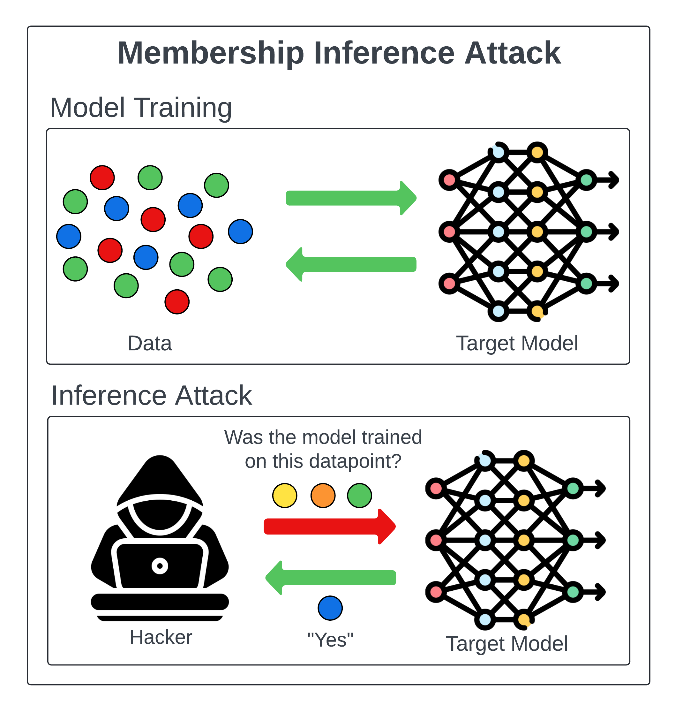

- Membership inference attacks occur when an attacker manipulates the model’s
  training data in order to cause it to behave in a way that exposes sensitive
  information. [zdroj](https://owasp.org/www-project-machine-learning-security-top-10/docs/ML04_2023-Membership_Inference_Attack)
- But a type of attack called “membership inference” makes it possible to 
  detect the data used to train a machine learning model. In many cases, 
  the attackers can stage membership inference attacks without having 
  access to the machine learning model’s parameters and just by observing 
  its output. Membership inference can cause security and privacy concerns
   in cases where the target model has been trained on sensitive 
  information.
  
  In membership inference attacks, the adversary does not necessarily need
   to have knowledge about the inner parameters of the target machine 
  learning model. Instead, the attacker only knows the model’s algorithm 
  and architecture (e.g., SVM, neural network, etc.) or the service used 
  to create the model. [zdroj](https://bdtechtalks.com/2021/04/23/machine-learning-membership-inference-attacks/)
- machine learning as a service (MaaS)
-
- In this attack, the attacker first trains a separate machine learning model, known as a membership inference model, on the output of the target model. The attacker trains the model to predict whether a particular data point (personal information) was part of the training dataset for the target 
  model (your model). [zdroj](https://www.michalsons.com/blog/membership-inference-attacks-a-new-ai-security-risk/64440)
-
-
- Základné postupy útoku
	- **Shadow dataset + shadow model**: útočník si vytvorí „tieňové“ dáta a model(y), aby napodobnil správanie cieľového modelu. [antispoofing.org](https://antispoofing.org/membership-inference-attacks-and-countermeasures/)
	- **API probing/investigácia**: zisťovanie počtu tried, vlastností výstupu, formátu pravdepodobnostného vektora atď. cez dotazovanie API. [antispoofing.org](https://antispoofing.org/membership-inference-attacks-and-countermeasures/)
	- **Generovanie shadow vzoriek**: štyri prístupy — **štatistické**, **active-learning**, **query-based** a **region-based** generovanie dát. [antispoofing.org](https://antispoofing.org/membership-inference-attacks-and-countermeasures/)
	- **Tréning útokového modelu**: binárny klasifikátor nad výstupným pravdepodobnostným vektorom (rozhoduje „member vs non-member“). [antispoofing.org](https://antispoofing.org/membership-inference-attacks-and-countermeasures/)
- {:height 832, :width 780}[zdroj](https://mindgard.ai/blog/ai-under-attack-six-key-adversarial-attacks-and-their-consequences)
-
- Konkrétne techniky/varianty MIA
	- **Likelihood Ratio Attack (LRA)**: využíva štatistiku a **confidence scores** (často so shadow modelmi) na rozhodnutie o členstve. [antispoofing.org](https://antispoofing.org/membership-inference-attacks-and-countermeasures/)
	- **MIA proti in-context learningu** (LLM): kombinácie ako **GAP attack**, **Inquiry** (pýta sa na známe sekvencie), **Repeat**, **Brainwash** (zámerné zavádzanie). [antispoofing.org](https://antispoofing.org/membership-inference-attacks-and-countermeasures/)
	- **MIA na syntetických zdravotných dátach**: zneužitie unikátnych „**signature**“ čŕt v EMR, ktoré sa môžu replikovať a prezrádzať členstvo. [antispoofing.org](https://antispoofing.org/membership-inference-attacks-and-countermeasures/)
	- **Similarity-distribution-based MIA**: pracuje s **distribúciou podobnosti** medzi cieľovou vzorkou a referenčnými dátami. [antispoofing.org](https://antispoofing.org/membership-inference-attacks-and-countermeasures/)
	- **Subpopulation-based MIA**: cieli na celé **subpopulácie** (praktickejšie, nevyžaduje veľa shadow modelov). [antispoofing.org](https://antispoofing.org/membership-inference-attacks-and-countermeasures/)
	- **User-level MIA**: využíva **metric/embedding learning** na premietnutie vstupov do latentného priestoru a inferenciu člena používateľa. [antispoofing.org](https://antispoofing.org/membership-inference-attacks-and-countermeasures/)
	- **Data-augmentation-based MIA**: semi-supervised prístup s **weak/strong** augmentáciami a tréningom na **agreement** predikcií. [antispoofing.org](https://antispoofing.org/membership-inference-attacks-and-countermeasures/)
	- **MIA na diffusion modeloch**: **kvantilová regresia** učí predikovať **distribúciu reconstruction loss** pre odhalenie členstva. [antispoofing.org](https://antispoofing.org/membership-inference-attacks-and-countermeasures/)
-
- --mitigation
- **Differential privacy.** It’s a technique you can use to protect personal information by adding noise to it.
-