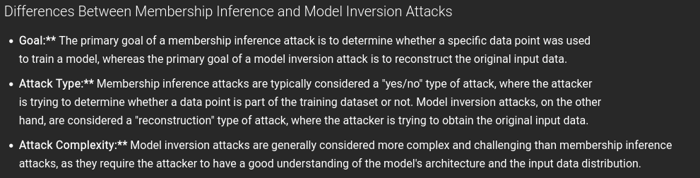

- Model inversion is a type of attack that uses the final output of an AI model to identify the original dataset on which the AI system was trained. In some cases, these attacks can allow attackers to reconstruct the information (including sensitive characteristics) that was used to 
  train the model. Essentially, the attacker uses one artificial intelligence to query another artificial intelligence, and asks the malicious artificial intelligence to determine what training data the 
  victim artificial intelligence would have needed to be trained on in order to respond as it does. [zdroj](https://www.hoganlovells.com/en/publications/model-inversion-and-membership-inference-understanding-new-ai-security-risks-and-mitigating-vulnerabilities)
-
-  [zdroj](https://infermatic.ai/ask/?question=What%20are%20the%20differences%20between%20a%20membership%20inference%20attack%20and%20a%20model%20inversion%20attack?)
-
- - neviem ci v tom pokracovat kedze