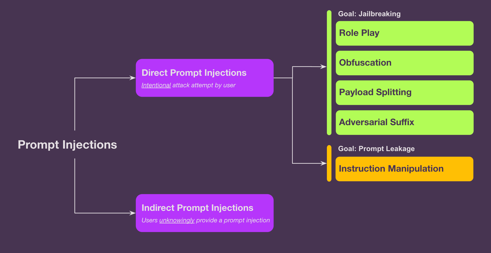
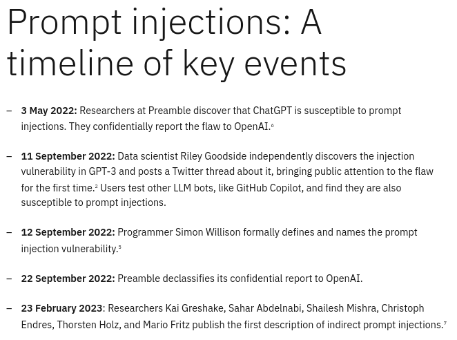

- Hackers disguise malicious inputs as legitimate prompts, manipulating generative AI systems (GenAI) into leaking sensitive data, spreading misinformation, or worse. [1](https://www.ibm.com/think/topics/prompt-injection)
	- Prompt injection vulnerabilities are a major concern for AI security 
	  collapsed:: true
	  researchers because no one has found a foolproof way to address them. 
	  Prompt injections take advantage of a core feature of generative artificial intelligence
	   systems: the ability to respond to users' natural-language 
	  instructions. Reliably identifying malicious instructions is difficult, 
	  and limiting user inputs could fundamentally change how LLMs operate. [1](https://www.ibm.com/think/topics/prompt-injection)
		- These inputs can affect the model even if 
		  they are imperceptible to humans, therefore prompt injections do not 
		  need to be human-visible/readable, as long as the content is parsed by 
		  the model.[2](https://genai.owasp.org/llmrisk/llm01-prompt-injection/)
- 
-
-
	- direct -  occur when a user’s prompt input directly 
	  alters the behavior of the model in unintended or unexpected ways. The 
	  input can be either intentional (i.e., a malicious actor deliberately 
	  crafting a prompt to exploit the model) or unintentional (i.e., a user 
	  inadvertently providing input that triggers unexpected behavior)[2](https://genai.owasp.org/llmrisk/llm01-prompt-injection/)
		- Attackers employ several methods to bypass defenses:
			- **Obfuscation**: Using Unicode characters or unusual formatting to hide malicious text from filters while keeping it readable to the LLM
			- **Token smuggling**: Splitting harmful words across multiple tokens (e.g., "Del ete a ll fil es") to evade detection
			- **Payload splitting**: Breaking an attack into multiple, seemingly innocent parts that combine to form the full exploit
			- **Recursive injection**: Nesting malicious prompts within legitimate-looking ones, creating layers of deception
			-
			-
			-  [zdroj](https://www.arthur.ai/blog/from-jailbreaks-to-gibberish-understanding-the-different-types-of-prompt-injections)
			-
			-
			- These techniques can work in combination [3](https://www.promptfoo.dev/blog/prompt-injection/#common-techniques)
			-
		-
	- indirect - manipulating external inputs processed by the LLM, such as embedding malicious content in web pages or user-provided data. Attackers plant malicious prompts in external data sources the LLM might access later. [3](https://www.promptfoo.dev/blog/prompt-injection/)
-
-
- Prompt injection can lead to unintended outcomes, including but not limited to:
	- Disclosure of sensitive information
	- Revealing sensitive information about AI system infrastructure or system prompts
	- Content manipulation leading to incorrect or biased outputs
	- Providing unauthorized access to functions available to the LLM
	- Executing arbitrary commands in connected systems
	- Manipulating critical decision-making processes [2](https://genai.owasp.org/llmrisk/llm01-prompt-injection/)
-
-  [image 2](https://www.ibm.com/think/topics/prompt-injection)
-
- https://embracethered.com/blog/posts/2024/m365-copilot-prompt-injection-tool-invocation-and-data-exfil-using-ascii-smuggling/?utm_source=chatgpt.com
- https://embracethered.com/blog/posts/2024/github-copilot-chat-prompt-injection-data-exfiltration/?utm_source=chatgpt.com